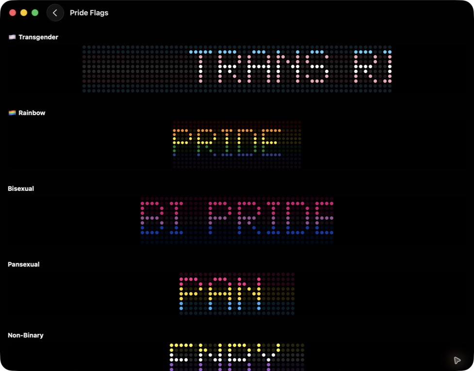
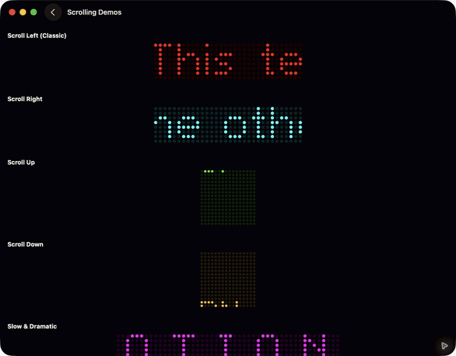

# PixelMarquee 🚀

A Swift library for simulating classic LED matrix sign displays with authentic circular LEDs, configurable colors, and smooth scrolling animations.


<p align="center">
  
</p>

<p align="center"><em>Authentic LED matrices with static, animated, and multi-color displays.</em></p>

## Features

- 🔴 **Authentic LED Look** - Circular LEDs with visible gaps, just like real matrix displays
- 🎨 **Full RGB Support** - Classic presets (red, green, amber) plus custom RGB colors
- 📜 **Smooth Scrolling** - Horizontal and vertical scrolling with configurable speed
- ⚡ **Blink Effects** - Attention-grabbing blinking animations
- 🕐 **Live Clock** - 12- or 24-hour time with optional seconds and time-zone support
- 🔤 **Built-in Font** - Complete 5×7 pixel font covering ASCII 32-126
- 🎯 **Custom Fonts** - Create and use your own pixel fonts
- 📱 **Cross-Platform** - SwiftUI, UIKit, and AppKit support
- ⚙️ **Highly Configurable** - Matrix size, LED styling, colors, and more

## Demo

<p align="center">
  
</p>

The included demo app showcases static text, four-way scrolling, blinking effects, color presets, Pride flag patterns, custom fonts, and an interactive playground.

## Requirements

- iOS 17.0+ / macOS 14.0+
- Swift 5.9+
- Xcode 15.0+

## Installation

### Swift Package Manager

Add PixelMarquee to your project using Xcode:

1. File → Add Package Dependencies
2. Enter the repository URL
3. Select your version rules

Or add it to your `Package.swift`:

```swift
dependencies: [
    .package(url: "https://github.com/rebeccathedev/PixelMarquee.git", from: "1.0.0")
]
```

## Quick Start

### Basic Usage

```swift
import SwiftUI
import PixelMarquee

struct ContentView: View {
    var body: some View {
        PixelMarqueeView("Hello, World!")
            .matrixSize(rows: 8, columns: 32)
            .ledColor(.red)
            .frame(height: 100)
    }
}
```

### Scrolling Text

```swift
PixelMarqueeView("Welcome to PixelMarquee!")
    .matrixSize(rows: 8, columns: 32)
    .ledColor(.amber)
    .scrolling(.left(speed: 30))
```

### Blinking Display

```swift
PixelMarqueeView("ALERT!")
    .matrixSize(rows: 8, columns: 32)
    .ledColor(.red)
    .effect(.blink(interval: 0.5))
```

### Live Clock

```swift
PixelMarqueeClockView(format: .twentyFourHourWithSeconds)
    .ledColor(.cyan)
    .frame(height: 100)
```

Choose from `.twelveHour`, `.twelveHourWithSeconds`, `.twentyFourHour`, or `.twentyFourHourWithSeconds`. Pass a `TimeZone` to display another location's local time.

### Custom Colors

```swift
// Using presets
.ledColor(.red)
.ledColor(.green)
.ledColor(.amber)
.ledColor(.blue)
.ledColor(.cyan)
.ledColor(.magenta)
.ledColor(.white)

// Custom RGB
.ledColor(LEDColor(r: 255, g: 100, b: 50))

// Array literal
let myColor: LEDColor = [255, 100, 50]
```

## API Reference

### PixelMarqueeView

The main SwiftUI view for displaying LED matrix content.

```swift
PixelMarqueeView(_ text: String, font: PixelFont = .default)
```

#### View Modifiers

| Modifier | Description |
|----------|-------------|
| `.matrixSize(rows:columns:)` | Set the LED matrix dimensions |
| `.ledColor(_:)` | Set the color of lit LEDs |
| `.ledStyle(diameter:spacing:)` | Customize LED appearance |
| `.backgroundColor(_:)` | Set the background color |
| `.unlitBrightness(_:)` | Set brightness of unlit LEDs (0-1) |
| `.effect(_:)` | Apply animation effect |
| `.scrolling(_:)` | Configure scrolling animation |
| `.paused(_:)` | Pause/resume animation |

### MarqueeEffect

```swift
enum MarqueeEffect {
    case none                           // Static display
    case scrolling(ScrollConfiguration) // Scrolling animation
    case blink(interval: TimeInterval)  // Blinking animation
}
```

### ScrollConfiguration

```swift
// Scroll directions
.scrolling(.left(speed: 30))
.scrolling(.right(speed: 30))
.scrolling(.up(speed: 20))
.scrolling(.down(speed: 20))

// With initial pause
.scrolling(.left(speed: 30, pauseAtStart: 2.0))

// Full configuration
.scrolling(ScrollConfiguration(
    direction: .left,
    speed: 30,
    pauseAtStart: 0,
    loops: true
))
```

### MatrixConfiguration

```swift
let config = MatrixConfiguration(
    rows: 8,
    columns: 32,
    ledDiameter: 0.7,    // 0.0-1.0, relative to cell
    ledSpacing: 1,        // Points between LEDs
    ledColor: .red,
    unlitBrightness: 0.15,
    backgroundColor: .black
)

// Presets
MatrixConfiguration.standard  // 8×32
MatrixConfiguration.small     // 8×16
MatrixConfiguration.large     // 16×64
MatrixConfiguration.wide      // 8×64
```

### LEDColor

```swift
// Presets
LEDColor.red
LEDColor.green
LEDColor.amber
LEDColor.blue
LEDColor.cyan
LEDColor.magenta
LEDColor.orange
LEDColor.white

// Custom
LEDColor(r: 255, g: 100, b: 50)

// Array literal
let color: LEDColor = [255, 100, 50]
```

## UIKit Integration

```swift
import UIKit
import PixelMarquee

class ViewController: UIViewController {
    override func viewDidLoad() {
        super.viewDidLoad()
        
        let marquee = PixelMarqueeUIView(text: "Hello, UIKit!")
        marquee.ledColor = .red
        marquee.effect = .scrolling(.left())
        marquee.translatesAutoresizingMaskIntoConstraints = false
        
        view.addSubview(marquee)
        
        NSLayoutConstraint.activate([
            marquee.centerXAnchor.constraint(equalTo: view.centerXAnchor),
            marquee.centerYAnchor.constraint(equalTo: view.centerYAnchor),
            marquee.widthAnchor.constraint(equalToConstant: 400),
            marquee.heightAnchor.constraint(equalToConstant: 100)
        ])
    }
}
```

## AppKit Integration

```swift
import AppKit
import PixelMarquee

class ViewController: NSViewController {
    override func viewDidLoad() {
        super.viewDidLoad()
        
        let marquee = PixelMarqueeNSView(text: "Hello, AppKit!")
        marquee.ledColor = .green
        marquee.effect = .scrolling(.left(speed: 40))
        marquee.translatesAutoresizingMaskIntoConstraints = false
        
        view.addSubview(marquee)
        
        NSLayoutConstraint.activate([
            marquee.centerXAnchor.constraint(equalTo: view.centerXAnchor),
            marquee.centerYAnchor.constraint(equalTo: view.centerYAnchor),
            marquee.widthAnchor.constraint(equalToConstant: 400),
            marquee.heightAnchor.constraint(equalToConstant: 100)
        ])
    }
}
```

## Custom Fonts

Create your own pixel fonts for specialized displays:

```swift
// Define glyphs using binary strings
let customGlyphs: [Character: PixelGlyph] = [
    "♥": PixelGlyph(rows: [
        "01010",
        "11111",
        "11111",
        "01110",
        "00100"
    ]),
    "★": PixelGlyph(rows: [
        "00100",
        "01110",
        "11111",
        "01110",
        "01010"
    ])
]

// Create font
let iconFont = PixelFont(
    glyphs: customGlyphs,
    height: 5,
    characterSpacing: 1,
    spaceWidth: 2
)

// Use in view
PixelMarqueeView("♥ ★ ♥", font: iconFont)
    .matrixSize(rows: 8, columns: 24)
```

## Examples

### News Ticker

```swift
PixelMarqueeView("BREAKING NEWS: Swift is awesome!")
    .matrixSize(rows: 8, columns: 64)
    .ledColor(.red)
    .scrolling(.left(speed: 50))
    .backgroundColor(.black)
```

### Store Open Sign

```swift
PixelMarqueeView("OPEN")
    .matrixSize(rows: 8, columns: 24)
    .ledColor(.green)
    .ledStyle(diameter: 0.8, spacing: 1)
```

### Alert Display

```swift
PixelMarqueeView("⚠ WARNING ⚠")
    .matrixSize(rows: 8, columns: 48)
    .ledColor(.amber)
    .effect(.blink(interval: 0.3))
```

### Stock Ticker

```swift
PixelMarqueeView("AAPL 178.50 ▲ | GOOGL 140.20 ▼ | MSFT 415.00 ▲")
    .matrixSize(rows: 8, columns: 96)
    .ledColor(.green)
    .scrolling(.left(speed: 35))
```

### Vertical Announcement

```swift
PixelMarqueeView("SALE")
    .matrixSize(rows: 32, columns: 24)
    .ledColor(.red)
    .scrolling(.up(speed: 15))
```

## Performance Tips

1. **Match matrix size to content** - Don't use a 128-column matrix for short text
2. **Use appropriate frame rates** - The default 60fps is smooth but battery-intensive
3. **Pause when not visible** - Use `.paused(true)` when the view is off-screen
4. **Reuse configurations** - Create `MatrixConfiguration` instances once and share them

## Contributing

Contributions are welcome! Please feel free to submit a Pull Request.

## License

PixelMarquee is available under the MIT license. See the LICENSE file for more info.

---

Made with ❤️ by Rebecca
